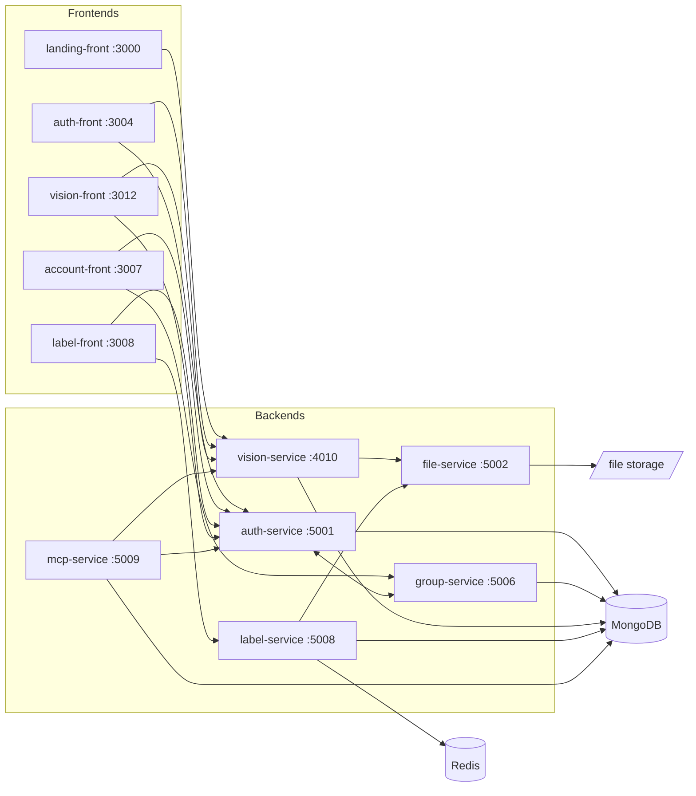

# Visin

Advanced Computer Vision & Analytics Platform — manage datasets, train models, and analyze results.

## Architecture

Visin is an npm-workspaces monorepo of six backend services and five React frontends.
Each app is independently buildable and deployable (its own `package.json`, `Dockerfile`,
and `compose.yml`).



| Workspace        | Port | Description                                        |
| ---------------- | ---- | -------------------------------------------------- |
| `vision-service` | 4010 | Datasets, training, analysis, benchmarks           |
| `auth-service`   | 5001 | Authentication (Google SSO), JWT, user management  |
| `file-service`   | 5002 | File upload/download with signed URLs              |
| `group-service`  | 5006 | User group management                              |
| `label-service`  | 5008 | Labeling bundles, jobs, tasks, answers, export     |
| `mcp-service`    | 5009 | MCP server exposing Visin data to AI assistants    |
| `landing-front`  | 3000 | Public landing page                                |
| `auth-front`     | 3004 | Sign-in page                                       |
| `account-front`  | 3007 | Account settings                                   |
| `label-front`    | 3008 | Labeling workbench and job administration          |
| `vision-front`   | 3012 | Main application UI                                |

The stack also needs MongoDB (every service except file-service) and Redis
(label-service's bundle-import queue). The root `compose.yml` runs both for you; a
production deployment can point at whatever instances you already operate.

### Auth

Two sign-in strategies, both issuing the same session:

- **Email + password** — always available. Passwords are hashed with scrypt (`node:crypto`, no native
  dependency) and never leave the database; `passwordHash` is `select: false` on the schema so it cannot
  leak through a controller that returns a user.
- **Google** — enabled only when `GOOGLE_CLIENT_ID` is set. Without it the button simply doesn't appear,
  and `/auth/validate` returns 403; nothing else changes.

User sessions ride an httpOnly `access_token` cookie issued by `auth-service` (its domain is a
shared parent across every Visin subdomain in production, so one cookie authenticates every backend service).
Backend services accept that cookie, falling back to an `Authorization: Bearer` header for non-browser callers —
vision-service's project API tokens use that header path, never the cookie.

Separately, **services calling each other** (not a user's browser) authenticate with an `X-Internal-Token` header,
checked in one of two ways depending on who else may call the route:

- **Service-only route** (e.g. an endpoint another backend calls but no frontend ever should): gate the whole
  router with `requireInternalServiceToken` — missing/invalid token is rejected outright.
- **Route shared by users and services** (e.g. group-service's group endpoints, which vision-service also calls
  internally): mount `validateInternalServiceToken` globally so it *attaches* `req.isInternalService` when the
  header is valid but never blocks, then gate each route with `allowUserOrInternalService` *after* the user auth
  middleware — it passes if either the caller is a validated internal service or a logged-in user.

Both live in `@visin/backend-core`'s `middleware/internalServiceAuth.ts`. Adding a new inter-service route means
picking the right one of these two; skipping the gate on a route meant to be internal-only silently opens it to
any authenticated user.

## Quickstart

### Run it

Docker is the only requirement.

```sh
git clone https://github.com/visin-platform/visin.git
cd visin
docker compose up -d
```

Then open <http://localhost:3000>. **No configuration is needed** — every secret
has a working development default, so a fresh clone boots as-is. The first run
builds the images and takes a few minutes; later runs start in seconds.

To reach it from another machine, give it an address that machine's browser can
resolve:

```sh
PUBLIC_HOST=http://192.168.1.10 docker compose up -d
```

Before putting it on a network, override `JWT_SECRET`, `INTERNAL_SERVICE_TOKEN`,
`FILE_SERVICE_API_KEY` and `FILE_SERVICE_HMAC_SECRET` in a `.env` beside
`compose.yml`, and set `NODE_ENV=production` — which also enables `Secure`
cookies, so serve it over HTTPS.

`docker compose down` stops everything; add `-v` to also discard the database
and uploaded files.

### Develop on it

For hot reload you need **Node.js 26+** as well (matching CI and the images).

```sh
# 1. Install all workspace dependencies (one install at the root covers every app)
npm install

# 2. Create local env files from the templates, then fill in the <change-me> values
for f in apps/backend/*/.env.example apps/frontend/*/.env.example; do cp -n "$f" "${f%.example}"; done

# 3. Start just the data stores (the apps run on the host, with hot reload)
docker compose up -d mongodb redis

# 4. Start all backends and frontends with hot reload
npm run dev
```

The landing page is then at <http://localhost:3000> and the main app at
<http://localhost:3012>. Add `--profile tools` to the compose command for a
mongo-express UI at <http://localhost:8081>.

Mongo and Redis are published on `127.0.0.1` only, so the host-run apps reach
them at `localhost:27017` / `localhost:6379` while nothing is exposed to the
network.

Backends and frontends can also be started separately with `npm run dev:back`
and `npm run dev:front`.

### 5. Create the first account

Open the sign-in page at <http://localhost:3004>. A fresh database has no users,
so it offers **Create the owner account** instead of a login form. That account
gets the `admin` role, because there is nobody who could grant it.

The setup form closes permanently as soon as it succeeds. Afterwards:

- Anyone can register at the same page and is signed in immediately. **There is
  no approval step** — what an account can actually reach is decided by group
  membership and by whether a project is public, so a new account with no groups
  simply sees only public work until someone invites it to a group
  (Account → Groups).
- Google sign-in is optional. Set `GOOGLE_CLIENT_ID` (auth-service) and
  `VITE_GOOGLE_CLIENT_ID` (auth-front) from a
  [Google OAuth client](https://console.cloud.google.com/apis/credentials) to
  enable it; leave them blank to run with passwords only. Google accounts must
  already exist — that path authenticates, it does not register.
- Signed in with Google and want a password too? **Account → Profile → Set a
  password.** Changing an existing password signs out every other session.

## Development commands

All commands run from the repo root, across every workspace:

```sh
npm run lint        # ESLint (flat config, zero warnings allowed)
npm run typecheck   # tsc --noEmit per workspace
npm test            # Jest (backends) + Vitest (frontends)
npm run test:coverage
npm run format      # Prettier
```

Scope any script to a single workspace with `--workspace`:

```sh
npm test --workspace=vision-service
```

CI runs lint, typecheck, and tests — but only for the workspaces a commit
touches (see `.github/workflows/test.yml`).

## Production deployment

The root `compose.yml` from [Quickstart](#run-it) is a complete deployment: set
the four secrets it names, `NODE_ENV=production`, and a `PUBLIC_HOST` your users
can reach, and put TLS in front of it.

To run services individually instead — separate hosts, a subset of the platform,
or your own orchestrator — each has its own `compose.yml` and multi-stage
`Dockerfile`, and depends on nothing outside its own directory:

```sh
cp .env.example .env
# fill in .env values
docker compose -f apps/backend/auth-service/compose.yml up -d
# repeat for other services
```

Those files run the published images from
`ghcr.io/visin-platform`, which carry builds for both `linux/amd64` and
`linux/arm64`, so the same tag works on a laptop and on a Raspberry Pi.

`TAG` defaults to `latest`. Pin a release instead — `latest` moves, and a
deployment that tracks it cannot be rolled back or identified after the fact:

```sh
TAG=1.0.0 docker compose -f apps/backend/auth-service/compose.yml up -d
```

`REGISTRY` points somewhere else, if you mirror the images or build your own.
Both variables work on the root `compose.yml` too.

Serving the frontends and APIs on separate hostnames needs a reverse proxy in
front; any will do. If you use one shared parent domain, set `COOKIE_DOMAIN` to
it so the session cookie reaches every subdomain.

## Contributing

See [CONTRIBUTING.md](CONTRIBUTING.md) for the workflow and branch naming, and
[CODE_OF_CONDUCT.md](CODE_OF_CONDUCT.md) for community standards. Security
issues: please follow [SECURITY.md](SECURITY.md) instead of opening a public
issue.

## License

MIT — see [LICENSE](LICENSE).

## Changelog

See [CHANGELOG.md](CHANGELOG.md) for release history.
