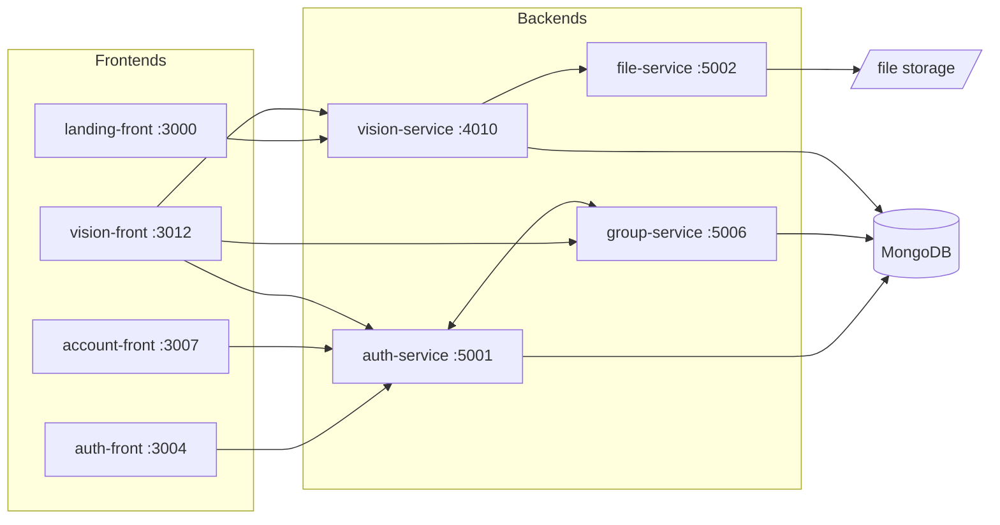

# Visin

Advanced Computer Vision & Analytics Platform — manage datasets, train models, and analyze results.

## Architecture

Visin is an npm-workspaces monorepo of four backend services and four React frontends.
Each app is independently buildable and deployable (its own `package.json`, `Dockerfile`,
and `compose.yml`).



| Workspace        | Port | Description                                       |
| ---------------- | ---- | ------------------------------------------------- |
| `auth-service`   | 5001 | Authentication (Google SSO), JWT, user management |
| `file-service`   | 5002 | File upload/download with signed URLs             |
| `group-service`  | 5006 | User group management                             |
| `vision-service` | 4010 | Datasets, training, analysis, benchmarks          |
| `landing-front`  | 3000 | Public landing page                               |
| `auth-front`     | 3004 | Sign-in page                                      |
| `account-front`  | 3007 | Account settings                                  |
| `vision-front`   | 3012 | Main application UI                               |

Infrastructure in `apps/infra/`: Nginx reverse proxy, MongoDB, Cloudflare DDNS cron.

### Auth

User sessions ride an httpOnly `access_token` cookie issued by `auth-service` on Google sign-in (its domain is a
shared parent across every Visin subdomain in production, so one cookie authenticates all four services).
Backend services accept that cookie, falling back to an `Authorization: Bearer` header for non-browser callers —
vision-service's project API tokens use that header path, never the cookie.

Separately, **services calling each other** (not a user's browser) authenticate with an `X-Internal-Token` header,
checked in one of two ways depending on who else may call the route:

- **Service-only route** (e.g. an endpoint another backend calls but no frontend ever should): gate the whole
  router with `requireInternalServiceToken` — missing/invalid token is rejected outright.
- **Route shared by users and services** (e.g. group-service's group endpoints, which vision-service also calls
  internally): mount `validateInternalServiceToken` globally so it *attaches* `req.isInternalService` when the
  header is valid but never blocks, then gate each route with `allowUserOrInternalService` *after* the user auth
  middleware — it passes if either the caller is a validated internal service or a logged-in user.

Both live in `@visin/backend-core`'s `middleware/internalServiceAuth.ts`. Adding a new inter-service route means
picking the right one of these two; skipping the gate on a route meant to be internal-only silently opens it to
any authenticated user.

## Prerequisites

- **Node.js 26+** (matches CI and the Docker images)
- **Docker** (for MongoDB in development, and for deployment)

## Quickstart

```sh
# 1. Install all workspace dependencies (one install at the root covers every app)
npm install

# 2. Create local env files from the templates, then fill in the <change-me> values
for f in apps/backend/*/.env.example apps/frontend/*/.env.example; do cp -n "$f" "${f%.example}"; done

# 3. Start MongoDB
docker compose -f docker-compose.dev.yml up -d

# 4. Start all backends and frontends with hot reload
npm run dev
```

The landing page is then at <http://localhost:3000> and the main app at
<http://localhost:3012>. Add `--profile tools` to the compose command for a
mongo-express UI at <http://localhost:8081>.

Backends and frontends can also be started separately with `npm run dev:back`
and `npm run dev:front`.

> Google sign-in requires a `GOOGLE_CLIENT_ID` (auth-service) and
> `VITE_GOOGLE_CLIENT_ID` (auth-front) from a
> [Google OAuth client](https://console.cloud.google.com/apis/credentials);
> everything else works without external accounts.

## Development commands

All commands run from the repo root, across every workspace:

```sh
npm run lint        # ESLint (flat config, zero warnings allowed)
npm run typecheck   # tsc --noEmit per workspace
npm test            # Jest (backends) + Vitest (frontends)
npm run test:coverage
npm run format      # Prettier
```

Scope any script to a single workspace with `--workspace`:

```sh
npm test --workspace=vision-service
```

CI runs lint, typecheck, and tests — but only for the workspaces a commit
touches (see `.github/workflows/test.yml`).

## Production deployment

Each service has its own `compose.yml` and multi-stage `Dockerfile`. A shared
root `.env` (copied from `.env.example`) provides secrets to all containers.

```sh
cp .env.example .env
# fill in .env values
docker compose -f apps/backend/auth-service/compose.yml up -d
# repeat for other services
```

Deploys run via GitHub Actions (`Deploy Application Service` workflow), which
builds each app's image from its own directory — apps never rely on the
monorepo root at runtime. See `apps/infra/visin-proxy/` for the Nginx reverse
proxy setup.

## Contributing

See [CONTRIBUTING.md](CONTRIBUTING.md) for the workflow and branch naming, and
[CODE_OF_CONDUCT.md](CODE_OF_CONDUCT.md) for community standards. Security
issues: please follow [SECURITY.md](SECURITY.md) instead of opening a public
issue.

## License

MIT — see [LICENSE](LICENSE).

## Changelog

See [CHANGELOG.md](CHANGELOG.md) for release history.
