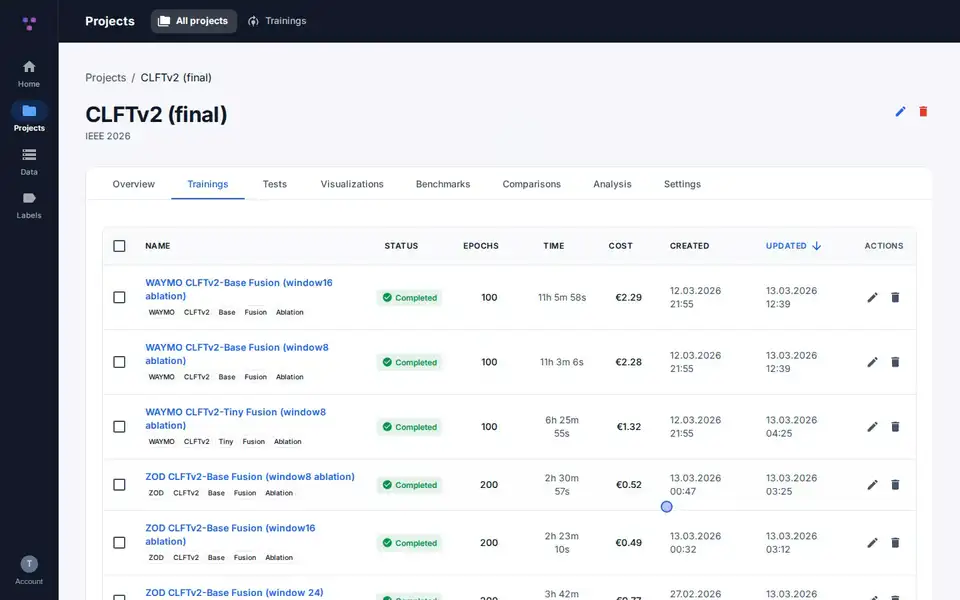
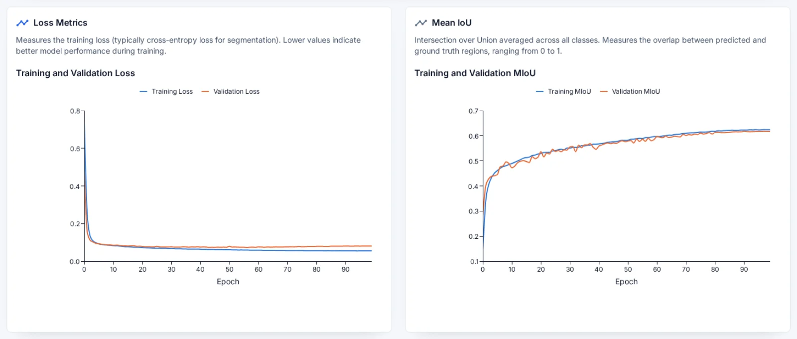
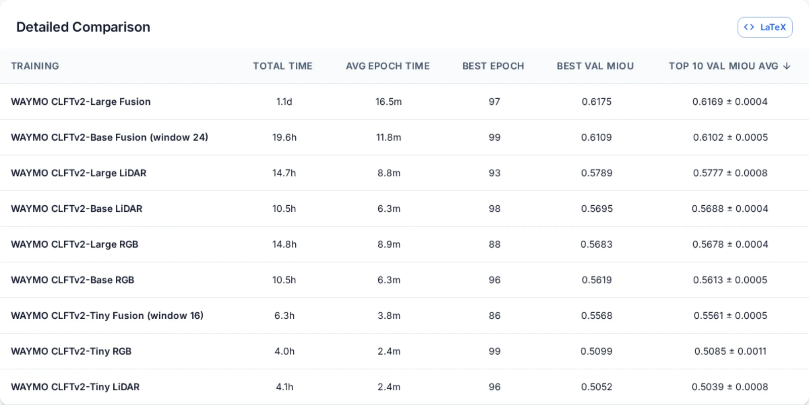
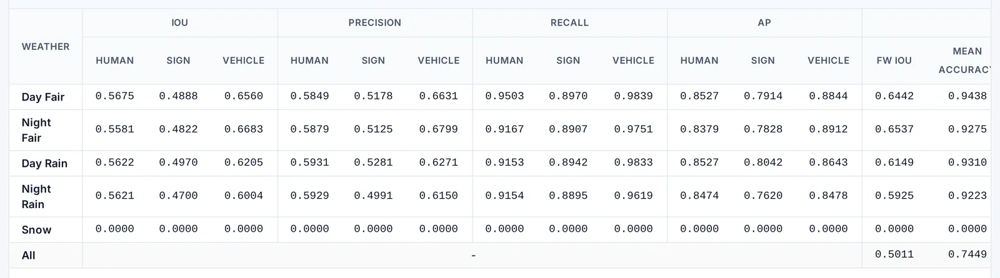
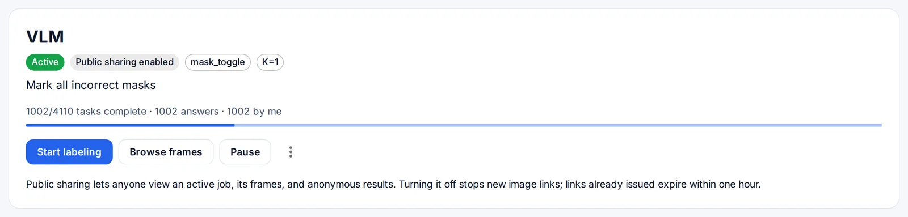
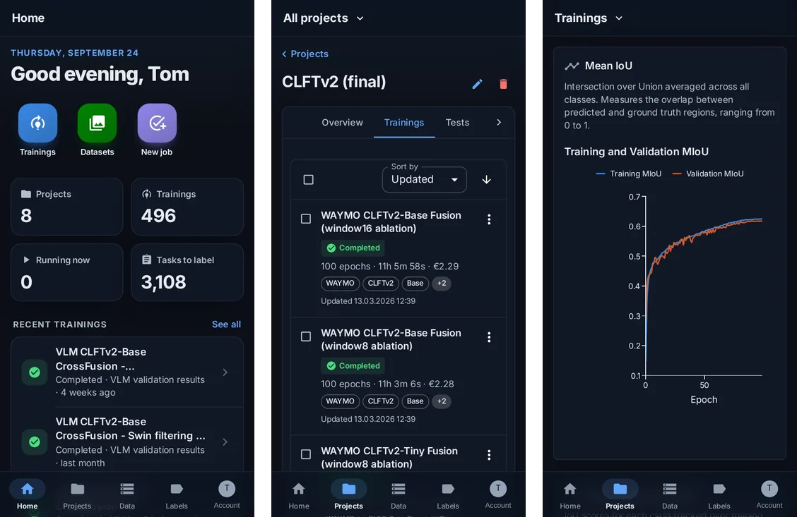

<h1> Visin</h1>

**See what your training runs actually did.** Every epoch, score and rendered frame — charted, compared, and
readable by your AI assistant. Self-hosted, MIT licensed.



<table>
  <tr>
    <td width="50%"><br /><b>Every epoch, charted</b> — curves for each run, as your script posts them.</td>
    <td width="50%"><br /><b>Runs compared at their best</b> — side by side at the best epoch, not the last.</td>
  </tr>
  <tr>
    <td><br /><b>Per class, per condition</b> — test scores broken down the way your data is.</td>
    <td><br /><b>Labeling as a team</b> — split a job across your group.</td>
  </tr>
</table>

<p align="center">
  <br />
  <b>Installs on your phone</b> — open it in the browser and add it to the home screen.
</p>

## Run it

Docker is the only requirement. No configuration: every secret has a working development default.

```sh
git clone https://github.com/visin-platform/visin.git
cd visin
docker compose up -d
```

Open <http://localhost:3000>. The first run builds the images and takes a few minutes.

- **From another machine:** `PUBLIC_HOST=http://192.168.1.10 docker compose up -d`
- **On a network:** override `JWT_SECRET`, `INTERNAL_SERVICE_TOKEN`, `FILE_SERVICE_API_KEY` and
  `FILE_SERVICE_HMAC_SECRET` in a `.env` beside `compose.yml`, set `NODE_ENV=production` (which enables `Secure`
  cookies), and serve it over HTTPS.
- **Stop:** `docker compose down`; add `-v` to discard the database and uploaded files too.

## Connect an assistant

Anything that speaks MCP — Claude, ChatGPT — can read your runs. Point it at:

```
http://localhost:5009/mcp
```

Sign in when it asks and tick what it may do. It reads epochs, scores, benchmarks and rendered frames, and writes
findings back only if you let it — never more than your own account can see. Connected apps are listed, and can be
disconnected, in account settings. Hosted assistants need a public HTTPS address, e.g.
`https://mcp.example.com/mcp` behind your reverse proxy.

<p align="center">
  <br />
  <b>Ask about your runs in plain language.</b>
</p>

## Your own vocabulary

Visin assumes nothing about what your images contain. Post results in your own terms; tables, charts and LaTeX
exports size themselves to them — two classes give you two columns, and nothing has to be registered first.

```jsonc
// POST /api/test-results — condition and class names are yours to choose
{
  "epoch": 40,
  "epoch_uuid": "…",
  "test_results": {
    "line_a": {                                       // a "condition": any grouping you like
      "scratch": { "iou": 0.41, "precision": 0.55 },  // a class: whatever your model predicts
      "dent":    { "iou": 0.88, "precision": 0.91 },
      "overall": { "mean_dice": 0.64 }
    },
    "line_b": { "scratch": { "iou": 0.39 }, "overall": { "mean_dice": 0.60 } }
  }
}
```

A project's optional **taxonomy** (Project → Settings → Result Labels) only changes how that reads: the name of the
condition axis ("Weather", "Site", "Split"), display names, colours and order — and, for each metric, **whether
higher or lower is better**, the one thing your data cannot say. It never restricts what a pipeline may report.

<details>
<summary><b>What's inside</b> — seven services, six frontends</summary>

<br />

| Workspace        | Port | Purpose                                           |
| ---------------- | ---- | ------------------------------------------------- |
| `vision-service` | 4010 | Projects, training, analysis, benchmarks          |
| `auth-service`   | 5001 | Authentication, sessions, user management         |
| `file-service`   | 5002 | File upload and download with signed URLs         |
| `group-service`  | 5006 | User groups                                       |
| `label-service`  | 5008 | Labeling jobs, tasks, answers, export             |
| `mcp-service`    | 5009 | MCP server exposing Visin data to AI assistants   |
| `dataset-service`| 5010 | Dataset zips, their imported images, image groups |
| `landing-front`  | 3000 | Public landing page                               |
| `auth-front`     | 3004 | Sign-in                                           |
| `account-front`  | 3007 | Account settings                                  |
| `label-front`    | 3008 | Labeling workbench and job administration         |
| `shell-front`    | 3010 | One page for Vision, Labeling and Account         |
| `vision-front`   | 3012 | Main application UI                               |

Each app has its own `package.json`, `Dockerfile` and `compose.yml`, and depends on nothing outside its own
directory at build or run time. MongoDB serves every service except file-service; Redis serves dataset-service's
import queue. The root `compose.yml` runs both.

</details>

<details>
<summary><b>Develop on it</b></summary>

<br />

Hot reload additionally needs **Node.js 26+**, matching CI and the images.

```sh
npm install

# one .env per app, from the templates beside them
for f in apps/backend/*/.env.example apps/frontend/*/.env.example; do cp -n "$f" "${f%.example}"; done

docker compose up -d mongodb redis   # data stores only; the apps run on the host
npm run dev
```

Fill in the `<change-me>` values in the copied `.env` files. Mongo and Redis are published on `127.0.0.1` only.
`npm run dev:back` and `npm run dev:front` start each half; `--profile tools` on the compose command adds
mongo-express on <http://localhost:8081>.

```sh
npm run lint            # ESLint, zero warnings allowed
npm run typecheck       # tsc --noEmit per workspace
npm test                # Jest (backends) + Vitest (frontends)
npm run test:coverage   # every workspace enforces a coverage floor
npm run format          # Prettier
```

Shared libraries are consumed from npm, not from the workspace, because a service's Docker build never sees the
monorepo. After changing one, publish it and let `npm run sync:libs` re-pin consumers; `npm run lockfiles` then
refreshes the per-service lockfiles. CI fails on drift in either. Architecture notes are in [CLAUDE.md](CLAUDE.md).

</details>

<details>
<summary><b>Production deployment</b></summary>

<br />

The root `compose.yml` is a complete deployment: set the four secrets above, `NODE_ENV=production` and a
`PUBLIC_HOST` your users can reach, and put TLS in front of it.

To run services individually — separate hosts, a subset, your own orchestrator — each has its own `compose.yml`:

```sh
cp .env.example .env   # fill in the values
docker compose -f apps/backend/auth-service/compose.yml up -d
```

They run the published images from `ghcr.io/visin-platform`, built for `linux/amd64` and `linux/arm64` (a laptop
or a Raspberry Pi). Pin a release with `TAG=1.0.0` — `latest` moves, and cannot be rolled back — and point
`REGISTRY` elsewhere if you mirror the images. Both work on the root `compose.yml` too.

On separate hostnames, put any reverse proxy in front; with one shared parent domain, set `COOKIE_DOMAIN` to it so
the session cookie reaches every subdomain.

</details>

## Contributing

[CONTRIBUTING.md](CONTRIBUTING.md) · [Code of conduct](CODE_OF_CONDUCT.md) · Security issues:
[SECURITY.md](SECURITY.md), not a public issue · [Changelog](CHANGELOG.md) · MIT — [LICENSE](LICENSE)
