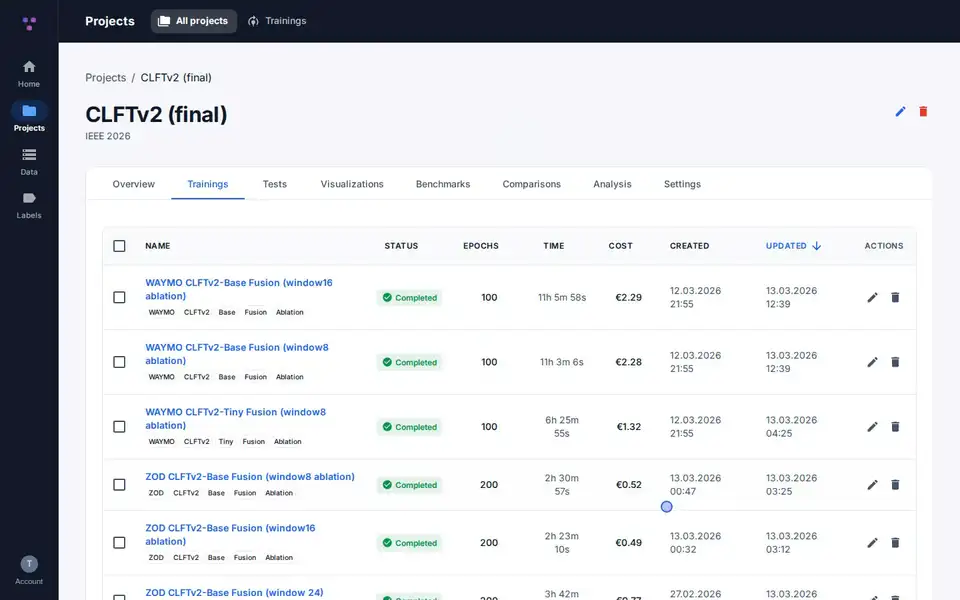
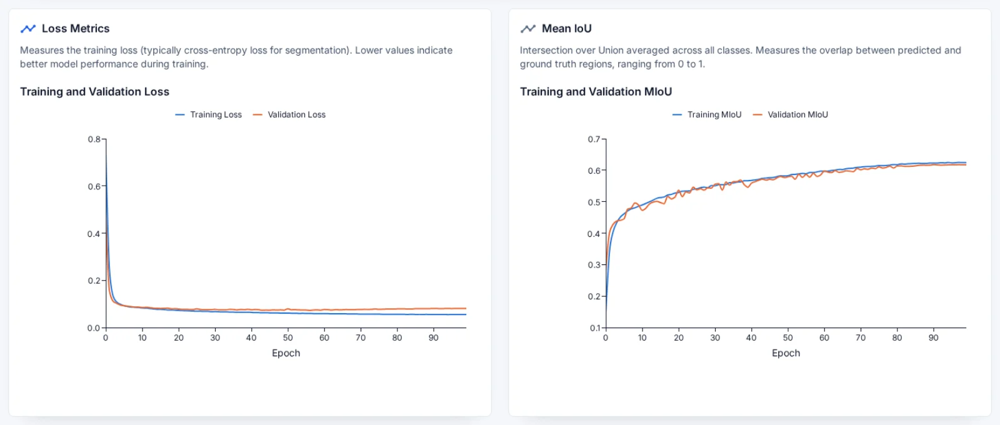
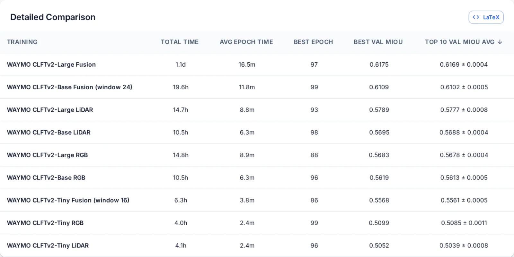
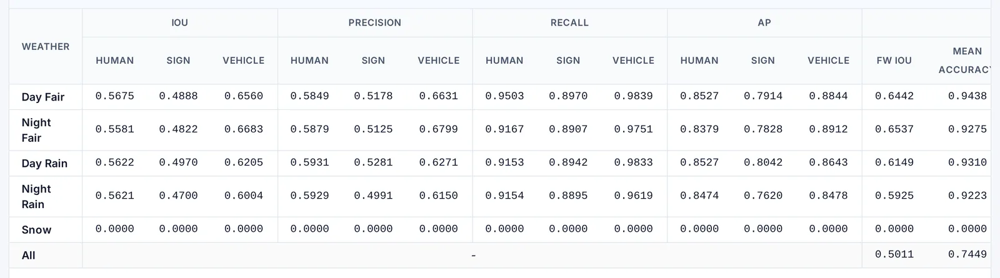
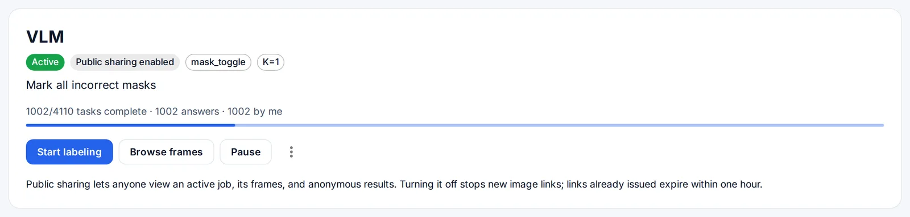
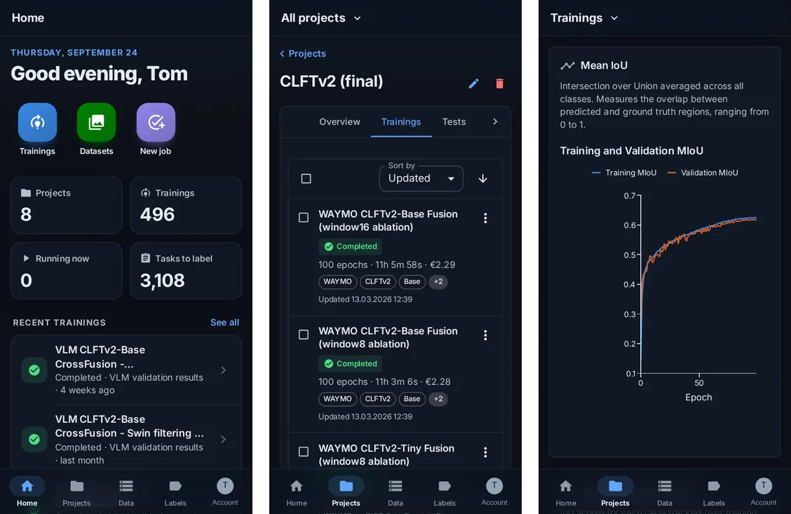
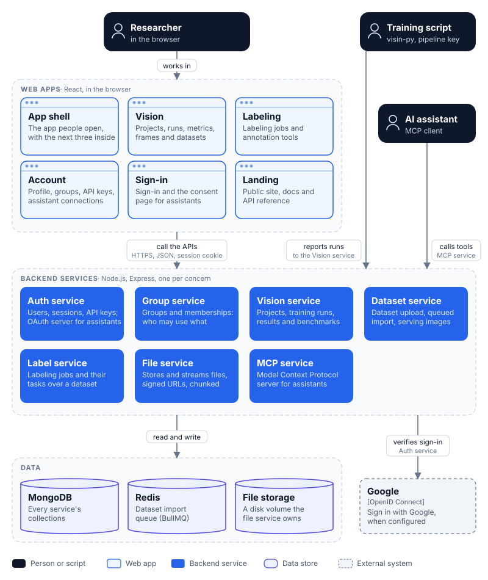

<h1> Visin</h1>

**A clear view of your computer vision work.** Track training runs, compare results, label images, and review the
data behind each decision. Visin runs on your hardware, is open source under the AGPL-3.0, and can connect to an AI assistant.



<table>
  <tr>
    <td width="50%"><br /><b>Every epoch, charted</b><br />See the curves your training script sends.</td>
    <td width="50%"><br /><b>Runs compared at their best</b><br />Each run at its strongest epoch, and the table ready for your paper as LaTeX.</td>
  </tr>
  <tr>
    <td><br /><b>Per class, per condition</b><br />Break test scores down to match your data.</td>
    <td><br /><b>Labeling as a team</b><br />Share labeling work across your group.</td>
  </tr>
</table>

<p align="center">
  <br />
  <b>Review runs from your phone</b><br />Open Visin in the browser and add it to your home screen.
</p>

## Run it

Docker is the only requirement. No configuration: every secret has a working development default.

```sh
git clone https://github.com/visin-platform/visin.git
cd visin
docker compose up -d
```

Open <http://localhost:3000>. The first run builds the images and takes a few minutes.
Choose **Get started**; an empty installation offers **Create owner account** on its sign-in page.

- **From another machine:** `PUBLIC_HOST=http://192.168.1.10 docker compose up -d`
- **On a network:** follow [Production deployment](#production-deployment) before inviting users.
- **Stop:** `docker compose down`; add `-v` to discard the database and uploaded files too.

For a first integration, follow the [training script quickstart](apps/frontend/landing-front/src/docs/content/quickstart.mdx).
The running site also serves the [guides](http://localhost:3000/docs) and
[API reference](http://localhost:3000/docs/api).

## Connect an assistant

Anything that speaks MCP — Claude, ChatGPT — can read your runs. Point it at:

```
http://localhost:5009/mcp
```

Sign in when it asks and tick what it may do. It reads epochs, scores, benchmarks and rendered frames, and writes
findings back only if you let it — never more than your own account can see. Connected apps are listed, and can be
disconnected, in account settings. Hosted assistants need a public HTTPS address, e.g.
`https://mcp.example.com/mcp` behind your reverse proxy.

<p align="center">
  <br />
  <b>Ask about your runs in plain language.</b>
</p>

## Your own vocabulary

Visin assumes nothing about what your images contain. Post results in your own terms; tables, charts and LaTeX
exports size themselves to them — two classes give you two columns, and nothing has to be registered first.

```jsonc
// POST /api/test-results — condition and class names are yours to choose
{
  "epoch": 40,
  "epoch_uuid": "…",
  "test_results": {
    "line_a": {
      // a "condition": any grouping you like
      "scratch": { "iou": 0.41, "precision": 0.55 }, // a class: whatever your model predicts
      "dent": { "iou": 0.88, "precision": 0.91 },
      "overall": { "mean_dice": 0.64 }
    },
    "line_b": { "scratch": { "iou": 0.39 }, "overall": { "mean_dice": 0.6 } }
  }
}
```

A project's optional **taxonomy** (Project → Settings → Result Labels) only changes how that reads: the name of the
condition axis ("Weather", "Site", "Split"), display names, colours and order — and, for each metric, **whether
higher or lower is better**, the one thing your data cannot say. It never restricts what a pipeline may report.

<details>
<summary><b>What's inside</b> — seven services, six frontends</summary>

<br />

| Workspace         | Port | Purpose                                           |
| ----------------- | ---- | ------------------------------------------------- |
| `vision-service`  | 4010 | Projects, training, analysis, benchmarks          |
| `auth-service`    | 5001 | Authentication, sessions, user management         |
| `file-service`    | 5002 | File upload and download with signed URLs         |
| `group-service`   | 5006 | User groups                                       |
| `label-service`   | 5008 | Labeling jobs, tasks, answers, export             |
| `mcp-service`     | 5009 | MCP server exposing Visin data to AI assistants   |
| `dataset-service` | 5010 | Dataset zips, their imported images, image groups |
| `landing-front`   | 3000 | Public landing page                               |
| `auth-front`      | 3004 | Sign-in                                           |
| `account-front`   | 3007 | Account settings                                  |
| `label-front`     | 3008 | Labeling workbench and job administration         |
| `shell-front`     | 3010 | One page for Vision, Labeling and Account         |
| `vision-front`    | 3012 | Main application UI                               |

Each app has its own `package.json`, `Dockerfile` and `compose.yml`, and depends on nothing outside its own
directory at build or run time. MongoDB serves every service except file-service; Redis serves dataset-service's
import queue. The root `compose.yml` runs both.

</details>

## How it fits together

Six web apps in the browser, seven small services behind them, MongoDB and Redis for storage. The
[architecture page](apps/frontend/landing-front/src/docs/content/architecture.mdx) (`/docs/architecture` on a running
Visin) walks through it, and each diagram is an SVG in
[`public/architecture/`](apps/frontend/landing-front/public/architecture), drawn by `npm run diagrams`.



## Develop on it

<details>
<summary><b>Local development steps</b></summary>

<br />

Hot reload additionally needs **Node.js 26+**, matching CI and the images.

```sh
npm install

# one .env per app, from the templates beside them
for f in apps/backend/*/.env.example apps/frontend/*/.env.example; do cp -n "$f" "${f%.example}"; done

docker compose up -d mongodb redis   # data stores only; the apps run on the host
npm run dev
```

Fill in the `<change-me>` values in the copied `.env` files. Mongo and Redis are published on `127.0.0.1` only.
`npm run dev:back` and `npm run dev:front` start each half; `--profile tools` on the compose command adds
mongo-express on <http://localhost:8081>.

```sh
npm run lint            # ESLint, zero warnings allowed
npm run typecheck       # tsc --noEmit per workspace
npm test                # Jest (backends) + Vitest (frontends)
npm run test:coverage   # every workspace enforces a coverage floor
npm run format          # Prettier
```

MongoDB integration tests share [one Jest setup](scripts/jest-mongo-setup.mjs). It checks the required Node VM
flag, downloads the test binary once before suites start, and passes its executable path to every suite with
further downloads disabled. The default version is `8.3.9`, matching Compose; `MONGOMS_VERSION` can override it
for deliberate compatibility testing. `MONGOMS_SYSTEM_BINARY` can select an already installed executable for
offline runs. Run through `npm test --workspace=<service>` so the VM flag is present.

This avoids downloading inside 120-second setup hooks. Jest isolates dependency module state between suites;
MongoMemoryServer's download lock checks both the PID and module-local state, so overlapping downloads from
isolated suites in the same process can overwrite the shared temporary archive. A preparation error now stops
the run before suites start and preserves the original cause. Tests exit normally rather than using `forceExit`.
The setup's offline failure-path checks run with `node --test scripts/jest-mongo-setup.test.mjs`.

Shared libraries are consumed from npm, not from the workspace, because a service's Docker build never sees the
monorepo. After changing one, publish it and let `npm run sync:libs` re-pin consumers; `npm run lockfiles` then
refreshes the per-service lockfiles. CI fails on drift in either. Architecture notes are in [CLAUDE.md](CLAUDE.md).
After adding a service or a call between services, update `scripts/architecture-diagrams.mjs` and run
`npm run diagrams`.

</details>

## Production deployment

<details>
<summary><b>Deployment steps</b></summary>

<br />

The root `compose.yml` runs one host with a single public hostname and distinct
ports for each app and API. Copy [the root template](.env.example) to `.env` and set
`JWT_SECRET`, `INTERNAL_SERVICE_TOKEN`, `FILE_SERVICE_API_KEY` and
`FILE_SERVICE_HMAC_SECRET` to fresh random values. Set `NODE_ENV=production`,
`PUBLIC_HOST=https://visin.example.com`, `COOKIE_DOMAIN=visin.example.com`,
`COMPOSE_BIND=127.0.0.1` and `CORS_ORIGIN` to all six HTTPS frontend origins.
For the example hostname, the CORS value is:

```dotenv
CORS_ORIGIN=https://visin.example.com:3000,https://visin.example.com:3004,https://visin.example.com:3007,https://visin.example.com:3008,https://visin.example.com:3010,https://visin.example.com:3012
```

Use your own hostname. Set `API_KEY_ENCRYPTION_SECRET` if users need to create API keys.

Put a TLS reverse proxy on the same host. Bind its listeners to the host's public
address so they do not conflict with Docker's loopback listeners. It must listen on
each published application port and forward to the matching `127.0.0.1` port; for example,
`https://visin.example.com:3000` → `127.0.0.1:3000` and
`https://visin.example.com:5001` → `127.0.0.1:5001`. `PUBLIC_HOST` must not
include a port because Compose appends one. With `COMPOSE_BIND=127.0.0.1`,
clients cannot reach the plain HTTP ports directly. MongoDB and Redis are
already bound to loopback. Start the stack with `docker compose up -d`.

To deploy services individually, use each app's `.env.example` and
`compose.yml`. Provide MongoDB, Redis (for dataset-service), and the shared
secrets and URLs needed by that app. The per-service files join an external
Docker network; create it once before starting them:

```sh
cp apps/backend/auth-service/.env.example apps/backend/auth-service/.env
# Fill in the production values in that file.
docker network create visinnet
docker compose --env-file apps/backend/auth-service/.env -f apps/backend/auth-service/compose.yml up -d
```

The per-service image names default to `ghcr.io/visin-platform` for
`linux/amd64` and `linux/arm64`; their Compose files also support local
builds. Pin `TAG` to a release and set `REGISTRY` if you mirror the images.
For separate hostnames, configure browser-facing URLs for each service and
set `COOKIE_DOMAIN` to their shared parent domain.

</details>

## Contributing

[CONTRIBUTING.md](CONTRIBUTING.md) · [Code of conduct](CODE_OF_CONDUCT.md) · Security issues:
[SECURITY.md](SECURITY.md), not a public issue · [Changelog](CHANGELOG.md) · [Licence](#licence)

## Licence

Visin's services and web apps are free software under the [GNU Affero General Public License v3.0](LICENSE). If you
run a modified Visin as a service, the AGPL asks you to offer your users the source of your modifications. The shared
libraries (`libs/*`, published to npm as `@visin/backend-core` and `@visin/frontend-core`) stay under the
[MIT licence](libs/backend-core/LICENSE), so they are easy to build on.

The [NOTICE](NOTICE.md) lists the copyright, the attribution a copy has to keep (AGPL section 7), and what the name
"Visin" and its logo may be used for. Releases before the switch to the AGPL stay under the MIT licence for anyone who
already has them.
